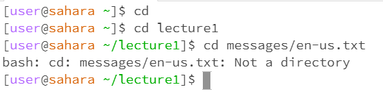
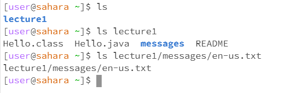
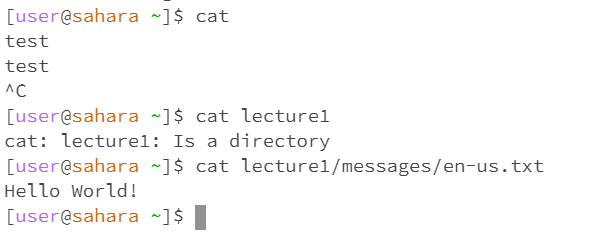

# Lab Report 1 - Remote Access and FileSystem

## Using `cd`

Without arguments, `cd` ran without a specified directory in "home" and
produced no output because there was not given a directory to switch 
to/enter. The lack of output was not an error, because `cd` is meant to 
be run in reference to a directory.

With a directory argument, the working directory changed from "home" to
"lecture1". There was not output in the traditional sense - there was no
text output - but rather a change next to the user name to signify the 
change into the directory "lecture1". The output is not an error, because 
it was given the argument that it is meant to work with, and produced the
correct result.

With a file path argument, the working directory used was "lecture1" and
the output was a message explaining that the given argument was not a 
directory. The output in this case is an error, because `cd` is meant to
be used with directories, not files.

## Using  `ls`

Without arguments, `ls` ran without a specified directory in "home" and 
printed the names of its contents, a single directory called "lecture1".
This was not an error.

Wtih a directory argument, `ls` ran without a specified directory again 
and printed the names of the contained files and folders. This is not
an error.

With a file path argument, `ls` ran without a specified directory again
and printed back the given argument. This is an error, because `ls` is
meant to be used with folders of some sort, so that it can show what is
being contained. This does not work with files, as they cannot contain
additional files.

## Using `cat`

Without arguments, `cat` ran without a specified directory in "home"
and printed back any text that was entered. "Ctrl+C" was used to exit 
and progress to the next command. This is an error, because it is
intended for use with files and folder arguments, not echoing back any
entered text. 

With a directory argument, `cat` ran without a specified directory in 
"home" and printed a message identifying the contents of "home". It 
declares "lecture1" as a directory. This is not an error. 

With a file path argument, `cat` ran without a specified directory in
"home" and printed the contents of the text file at
the end of the given path. This is not an error.

