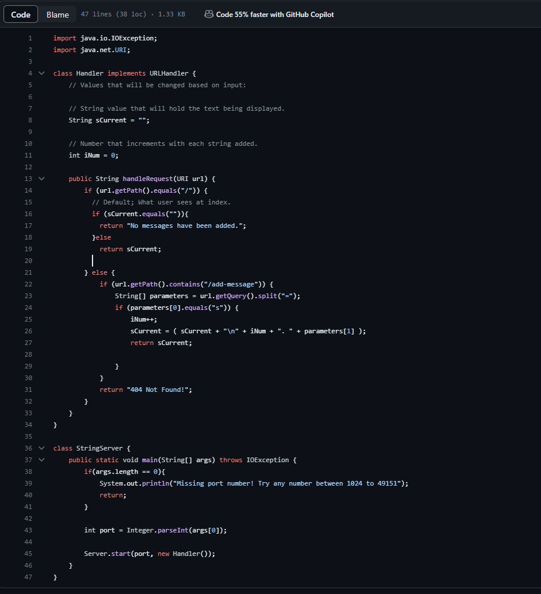
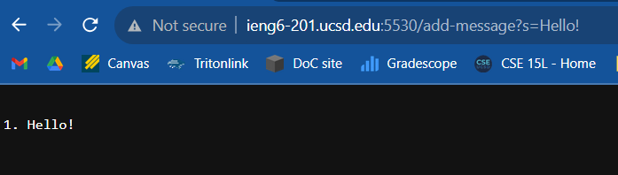
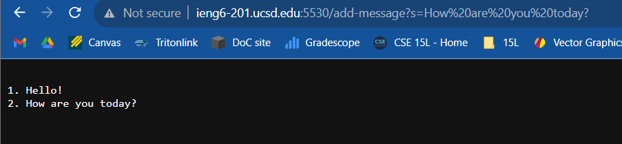
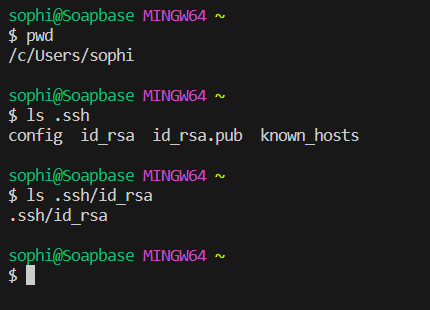
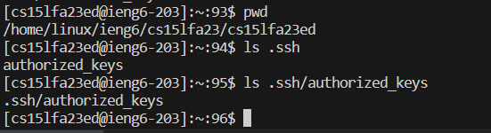
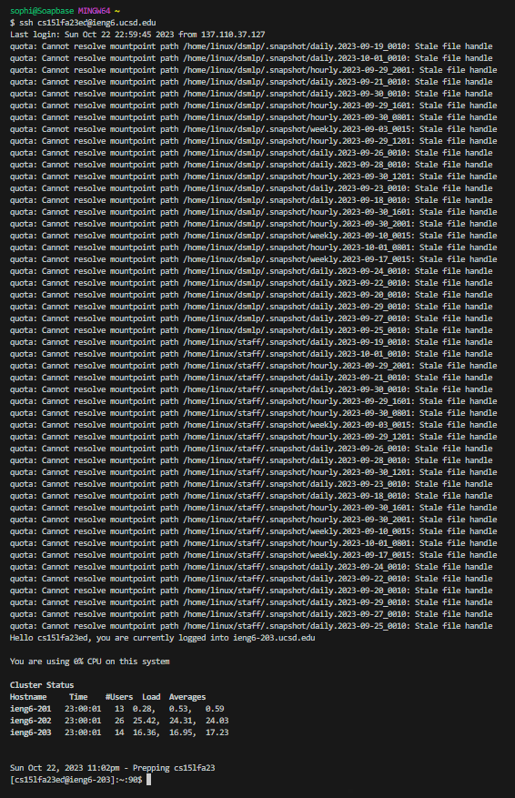

# Lab Report 2 - Servers and SSH Keys

## Part 1

### StringServer.java code:

### Adding "Hello!": 

* The primary method being called in terminal is `StringServer`,
but there are many methods nested inside that allow for the
results to show. Inside the definition of `StringServer`, there
is a call for `new Handler()` which has most of our working
methods inside it. The primary method in the Handler class
is `handleRequest`, which processes the url input and returns
the display results.

* Relevant arguments/values
1. For `StringServer`: a single argument, a string array that
contains the desired port number. Has one local variable, integer
`port` which holds the user's input as an integer.
2. For `Handler`: no arguments, but has two local variables, string
`sCurrent` and integer `iNum` which hold the string to be displayed
and the integer counting the lines added respectively.
3. For `handleRequest`: a single argument, a URI variable `url` that
contains the current url to the server site. Has three relevant
values, the variables `sCurrent` and `iNum` local to `Handler`,
and a string array `parameters` that holds strings deliminated by
an "=" after the query mark in the url.

* For this specific request, the only values that are affected
differently from any other request are `iNum`, `url` and `sCurrent`,
since the latter two are evaluating a string that does or will
contain "Hello!" specifically, and `iNum` is incremented. The other
values remain unchanged after this request, because they relate to
the server running itself, not the query request being handled. 

### Adding "How are you today?":

* The same methods are being called here as the above string:
`StringServer`, `Handler`, and `handleRequest`.

* The relevant arguments/values are as follows, which are the same
as above:

1. For `StringServer`: a single argument, a string array that
contains the desired port number. Has one local variable, integer
`port` which holds the user's input as an integer.
2. For `Handler`: no arguments, but has two local variables, string
`sCurrent` and integer `iNum` which hold the string to be displayed
and the integer counting the lines added respectively.
3. For `handleRequest`: a single argument, a URI variable `url` that
contains the current url to the server site. Has three relevant
values, the variables `sCurrent` and `iNum` local to `Handler`,
and a string array `parameters` that holds strings deliminated by
an "=" after the query mark in the url.

* Again, for this specific request, the only values that are affected
are `iNum`, `url` and `sCurrent`, since the latter two are evaluating
a string that does or will contain "How are you today?" specifically,
and `iNum` is incremented. The other values remain unchanged after this
request, because they relate to the server running itself, not the
query request being handled.

## Part 2

### `ls` to the *private* key:

### `ls` to the *public* key:

### Logging into `ieng6` without a password:

## Part 3

In this lab, I learned how to copy files from one server to another, 
to make a directory, and how to build and run a server. `scp` is
used for the first, `mkdir` is used for the second, and the last 
is done through a combination of commands, including but not limited 
to: `git clone`, `javac`, and `java`. In our case, it is also required
that you make a corresponding repository on GitHub.
