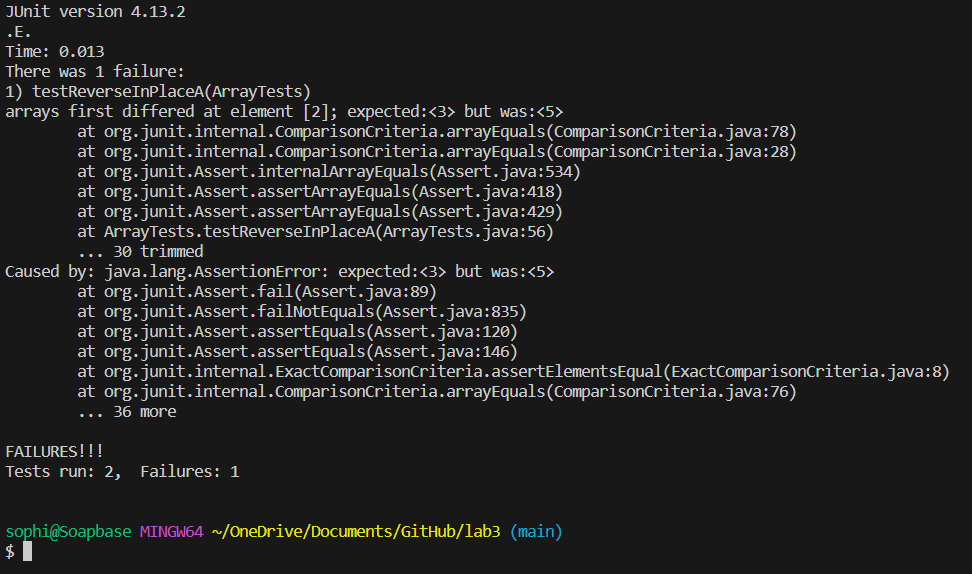

# Lab Report 3 - Bugs and Commands

## Part 1 - Bugs
For my bug, I have chosen the `reverseInPlace` method in the `ArrayExamples.java` file. 

Failing input:
```java
//Buggy method from ArrayExamples.java

// Changes the input array to be in reversed order
  static void reverseInPlace(int[] arr) {
    for(int i = 0; i < arr.length; i += 1) {
      arr[i] = arr[arr.length - i - 1];
    }
  }

//JUnit test with failing input from ArrayTests.java

@Test 
	public void testReverseInPlaceA() {
    int[] input1 = { 3, 4, 5};
    ArrayExamples.reverseInPlace(input1);
    assertArrayEquals(new int[]{ 5, 4, 3}, input1);
	}
```

Passing input:
```java
//Buggy method from ArrayExamples.java

// Changes the input array to be in reversed order
  static void reverseInPlace(int[] arr) {
    for(int i = 0; i < arr.length; i += 1) {
      arr[i] = arr[arr.length - i - 1];
    }
  }

//JUnit test with passing input from ArrayTests.java

@Test 
	public void testReverseInPlace() {
    int[] input1 = {8};
    ArrayExamples.reverseInPlace(input1);
    assertArrayEquals(new int[]{8}, input1);
	}

```

Symptoms:


The bug, before and after fixing:
```java
//The method 'reverseInPlace' with no changes, before fixing

  static void reverseInPlace(int[] arr) {
    for(int i = 0; i < arr.length; i += 1) {
      arr[i] = arr[arr.length - i - 1];
    }
  }

//The method 'reverseInPlace' with changes, after fixing

static void reverseInPlace(int[] arr) {
    int temp = 0;
    for(int i = 0; i < (arr.length/2); i += 1) {
      temp = arr[i];
      arr[i] = arr[arr.length - i - 1];
      arr[arr.length - i - 1] = temp;
    }
  }
```
Before the fix, the method would overwrite the values in the array that need to be assigned to a new index, producing "reversed" array with incorrect values. After the fix, the original value of an element is preseved in a temporary variable, and then swapped with the value in the element of intended index. This for loop is only iterated through half of the the array length, since the values are being "swapped" instead of just being overwritten.


## Part 2 - Researching Commands
