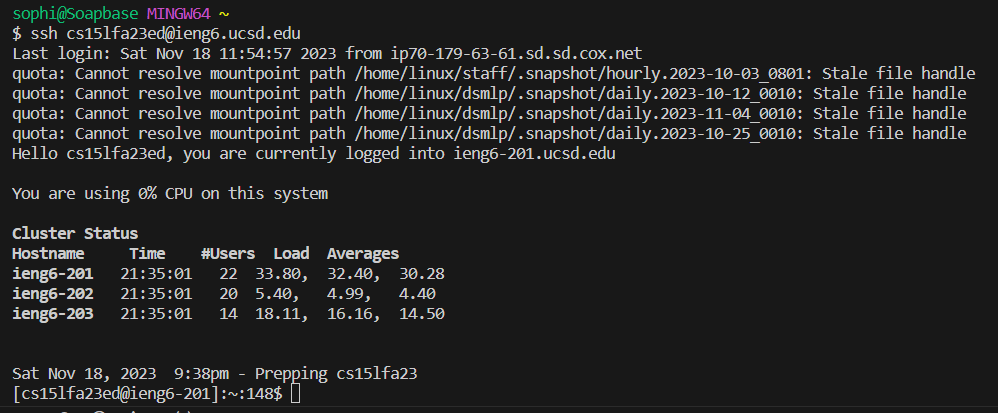
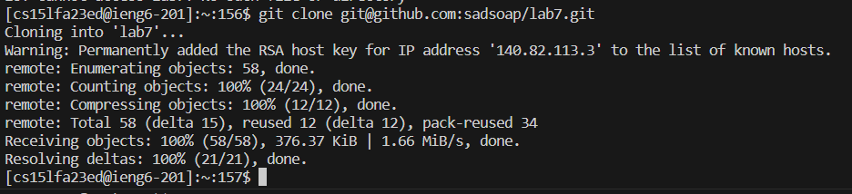
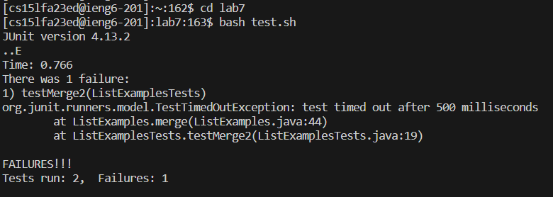
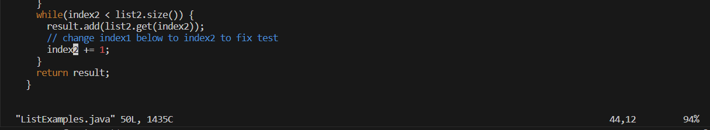
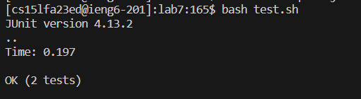
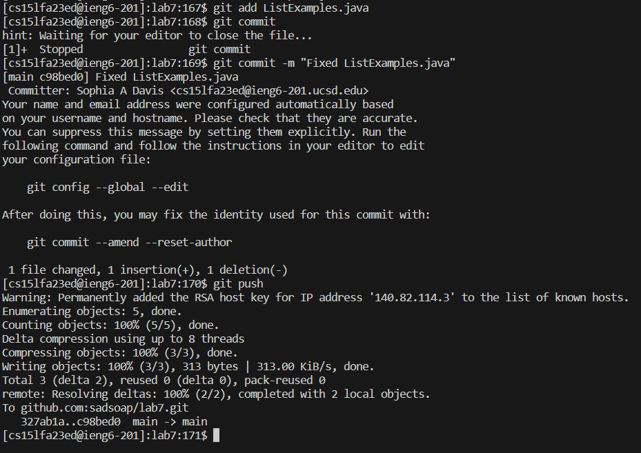

# Lab Report 4 - Vim

## Step 4 - Log into ieng6

#### Keystrokes:
`ssh<space>cs15lfa23ed@ieng6.ucsd.edu<enter>`

#### Summary:
I used the `ssh` command and my `ieng6` login information to log on to `ieng6-201`. Only my username was necessary, since authentification was processed using the existing key on my computer. 

## Step 5 - Clone the fork of lab7 using the `SSH` URL

#### Keystrokes:
`<click window with GitHub fork of lab7> <click code button> <click copy button under SSH>
<click window with VSC and bash terminal>
git <space> clone <space> <Ctrl> v <enter>`

#### Summary:
I copied the `SSH` URL for my fork of the lab7 repository using the cursor, then ran the `git clone` command after pasting the `SSH` URL as an argument. This cloned the forked lab7 repository into my remote home directory on `ieng6`.

## Step 6 - Run the tests, demonstrating failures

#### Keystrokes:
`cd <space> lab7 <enter>
bash <space> test.sh <enter>`

#### Summary:
I used `cd` to change directories into the lab7 repository, allowing me access to the files inside. One of said files is `test.sh`, which I know will compile and run the necessary java files to run the tests. I ran the bash script `test.sh`, subsequently running the tests and sending the output to the bash terminal.

## Step 7 - Edit the code file, fix the failing test

#### Keystrokes:
`vim <space> <shift> L <tab> .j <tab> <enter>
43j e x i 2 <esc>
:wq <enter>`

#### Summary:
I wrote the `vim` command, then the beginning differencial letters of the file named "ListExamples.java" followed by `tab` to fill out the file name with the least amount of keystrokes. This method also meant that I avoided any potential typos. Running the `vim` command opened the `ListExamples.java` file, with the cursor over the first character at the top of the file and in Command mode. Pressing `43j` made the cursor move down 43 lines, `e` made the cursor jump to the end of the first word and hover over the "1" in `index1`. I then pressed `x`, deleting the "1" under the cursor. Pressing `i` followed by `2` and `<esc>` switches Vim into Insert mode, places a "2", then exits from Insert mode back into Command mode. Finally, pressing `:wq<enter>` saves the changes made to the file (or "writes" them) and quits Vim, taking us back to the bash terminal.

## Step 8 - Run the tests, demonstating successes

#### Keystrokes:
`<up> <up> <enter>`

#### Summary:
I ran the command `bash test.sh` two commands prior in the bash history, so I used `<up> <up> <enter>` to fill the command line with `bash test.sh` and run the tests, which were now sucessful after the edit. 

## Step 9 - Commit/push the changes to Github account

#### Keystrokes:
`git <space> add <space> <shift> L <tab> <enter>
git <space> commit <space> -m <space> "Fixed <space> ListExamples.java" <enter>
git <space> push <enter>`

#### Summary:
I wrote the `git add` command, and used `<shift> L <tab>` to fill the name of the "ListExamples.java" file as the argument, running the command with `<enter>`. This added the file, with its changes, to the list of files/changes to be committed. Next I wrote `git commit -m "Fixed ListExamples.java"` and pressed `<enter>` which committed the changes to the local repository, in addition to attaching the written commit message, "Fixed ListExamples.java". Finally, I pushed and updated the lab7 repository on GitHub remotely with the command `git push`. 

