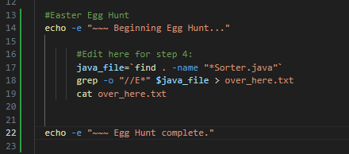
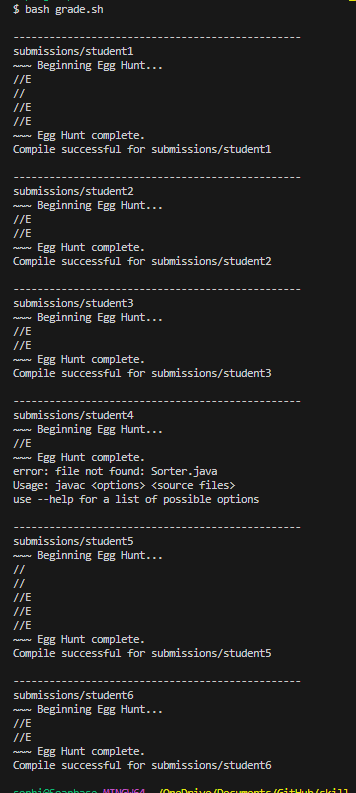
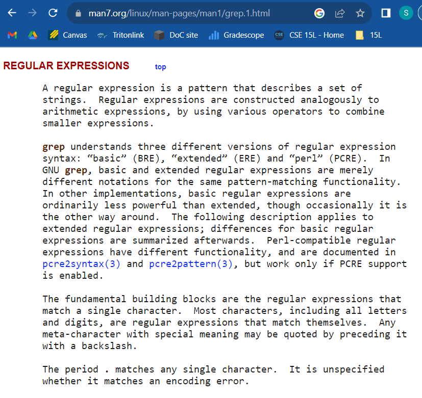
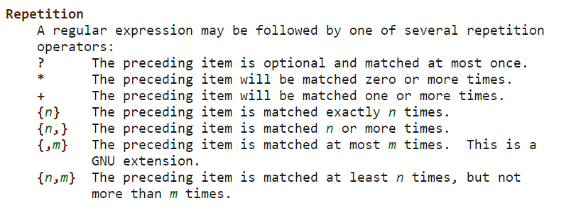
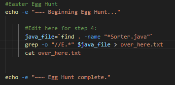
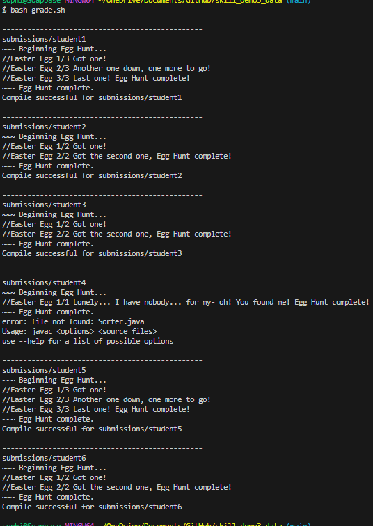
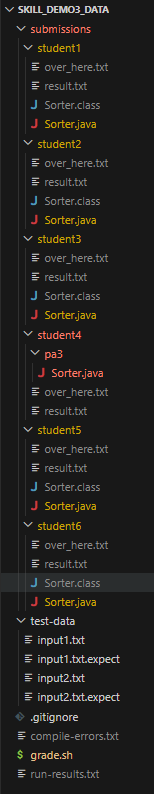

# Lab Report 5 - Putting it All Together 

## Part 1 - Debugging Scenario

### 1. Original post from student
**AnonyMouse1523 \[Student\]:** 

I'm having trouble with Lab 6 step 4, which says: 

*4. There are hidden 'Easter egg' comments in each student's java file. Edit* `grade.sh` *to list all of the comments in a file called* `over_here.txt` *in each student's directory under* `submissions/` *, and print them at the designated 'Egg Hunt' section at the beginning of each student's report.*

I have edited my bash script `grade.sh` to run the following bash commands. 

 

I got this output:

 

It looks like the bug is with my argument phrase for `grep`, but shouldn't `"//E*"` let me search for all comments starting with E, since (*) is a "wild card"?

### 2. Response from TA
**Sophia Davis \[TA\]:**
Good question! You're right, it looks like your bug is happening inside the argument phrase; it may help to take an extra look at the manual page for `grep`. Try running `grep --help` from the command line, or checking out this page: [https://man7.org/linux/man-pages/man1/grep.1.html](https://man7.org/linux/man-pages/man1/grep.1.html). ( *Hint: Look under the sections "Regular Expressions" and "Repetition"!* )

### 3. Response from student
**AnonyMouse1523 \[Student\]:** 

Thank you! I looked at the webpage and this:





Then, I fixed my code to get this:





My issue was that ( \* ) represents zero or more repetitions of the previous character, it's not a "wild card" like I thought. I added a ( . ) before ( \* ) in the argument phrase, which does represent a "wild card" character, but only a single one. I used both symbols together, because it tells the grep command to accept the rest of the line as part of the search argument.

### 4. Information needed for setup
* The student will need to fork and/or clone the repository at the link [https://github.com/sadsoap/skill_demo3_data.git](https://github.com/sadsoap/skill_demo3_data.git), which has the file structure:



* The contents of each file are nearly identical to the original repository, except for some edits to `grade.sh`, comments added each student's `Sorter.java` file, and a new file in each student's directory called `over_here.txt` which will be created by the "student" in this simulated example of a "Lab 6". The contents of the files added/changed before fixing the bug are as follows:

*Note: For simplicity, as this will already be very long, I will only show one of the seven students' `Sorter.java` and `over_here.txt` files.*

#### `grade.sh`

```sh

original_dir=`pwd`


for submission_dir in submissions/*
do
  #separators for reading from console
  echo -e "\n------------------------------------------------"

  echo $submission_dir
  cd $submission_dir

  #Easter Egg Hunt
  echo -e "~~~ Beginning Egg Hunt..."

        #Edit here for step 4:
        java_file=`find . -name "*Sorter.java"`
        grep -o "//E*" $java_file > over_here.txt
        cat over_here.txt


  echo -e "~~~ Egg Hunt complete."

  javac Sorter.java

  # Replace this with a condition that does the appropriate check
  if [[ $? -ne 0  ]]
  then
    echo "$submission_dir: Compile error" > result.txt    
    cd $original_dir
    continue
  else
    echo "Compile successful for $submission_dir"
  fi

  passed=0
  failed=0
  for test_file in $original_dir/test-data/*.txt
  do
    result=`java Sorter < $test_file`
    expect=`cat $test_file.expect`
    if [[ $expect == $result ]]
    then
      passed=$(( $passed+1 ))
    else
      failed=$(( $failed+1 ))
    fi
  done

  

  echo "$submission_dir: Test results: $passed passed, $failed failed" > result.txt
  cd $original_dir
done

all_results=`find submissions -name "result.txt"`
grep "Compile error" $all_results > compile-errors.txt

# Here, add code to put all of the results for files that successfully ran into
# run-results.txt

all_results=`find submissions -name "result.txt"`
grep "Test results" $all_results > run-results.txt
```

#### `student1`'s `Sorter.java`

```java
import java.util.ArrayList;
import java.util.Scanner;
import java.util.Collections;

class Sorter {
  public static void main(String[] args) {
    ArrayList<Integer> a = new ArrayList<>();
    Scanner in = new Scanner(System.in);

    String s = in.nextLine();
//Easter Egg 1/3 Got one!
    for(String num: s.split(" ")) {
      a.add(Integer.parseInt(num));
    }
    Collections.sort(a); // sort using a library function to save time
    for(Integer i: a) {
      System.out.print(i + " ");
    }//Easter Egg 2/3 Another one down, one more to go!

    System.out.println();
  }
}

//Easter Egg 3/3 Last one! Egg Hunt complete!

```

#### `student1`'s `over_here.txt`

```txt
//E
//
//E
//E
```

* The command run from the terminal was `bash.sh`, but the commands within the bash script that were run by the "student" to trigger the bug were:

```sh
java_file=`find . -name "*Sorter.java"`
        grep -o "//E*" $java_file > over_here.txt #The bug is here, in the argument "//E*"
        cat over_here.txt
```

* To fix the bug, the argument in the `grep` command needed to be edited from `"//E*"` to `"//E.*"`. The added dot operator allows any characters after "//E" to the end of the line to be read by `grep`.


## Part 2 - Reflection

Pretty much everything I learned in the second half of the quarter was new to me, but I appreciated learning how to navigate files and edit them more efficiently from the command line. I had only known how to edit them before using an IDE, so I'm grateful to be more comfortable now with the foundational aspects of a file system and working from a terminal.


